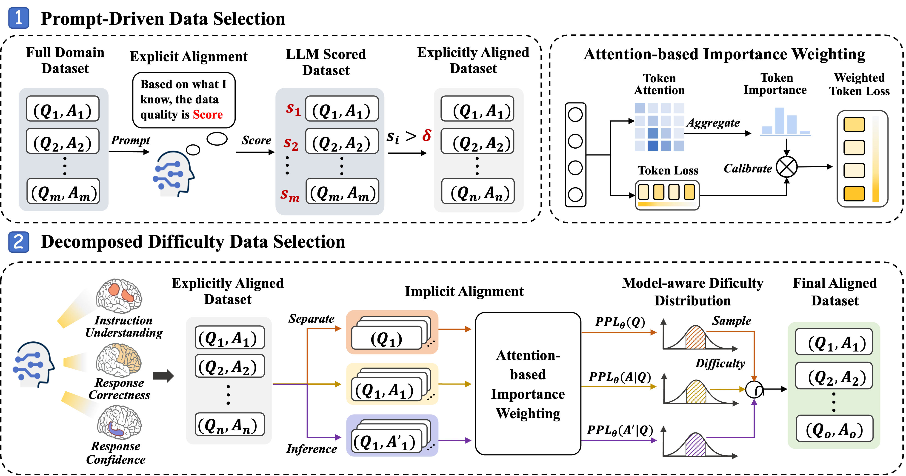

# README: 3DS Framework Implementation

This repository contains the code for **3DS: Decomposed Difficulty Data Selection’s Case Study on LLM Medical Domain Adaptation**. 

The dataset used in this study is publicly available at [https://drive.google.com/drive/folders/1SfrwQkDrQJ8i_EIqfc2Di0Xa5Y5pzY9H]


## Framework Overview

Below is the diagram of the framework:



The framework is composed of two stages:

1. **Stage 1: Prompt-Driven Data Selection**  
   This stage selects high-quality data by explicitly aligning the dataset with the target large language model (LLM) via a prompt-driven mechanism.  

2. **Stage 2: Decomposed Difficulty Data Selection**  
   This stage models the implicit distribution of the LLM to decompose data difficulty and filters the dataset using an attention-based importance weighting mechanism to calibrate difficulty calculation.

---

## How to Use the Code

### Prerequisites

To use this repository, ensure the following dependencies are installed: 

1. **Required Environment**: Ensure you have access to a LLM and a suitable environment for running the `llamafactory`(https://github.com/hiyouga/LLaMA-Factory) project.
2. **SpaCy**: The code requires SpaCy and the `zh_core_web_sm` model for processing Chinese text. Install them using the following commands:  
   ```bash
   pip install spacy
   python -m spacy download zh_core_web_sm
   ```

### Stage 1: Prompt-Driven Data Selection

1. Start a model inference API using **LlamaFactory[^1]**.

[^1]: Yaowei Zheng et al., *LlamaFactory: Unified Efficient Fine-Tuning of 100+ Language Models*, ACL 2024. [Paper Link](http://arxiv.org/abs/2403.13372)


2. Run the following command to score data for quality:  
   ```bash
   python local_model_path.py --input_path '../data/meddata_singleround_data.json' --output_path '../data/qwen1_5_7b/qwen1_5_7b_rated_result.jsonl'
   ```

3. Select high-quality data based on a quality threshold:  
   ```bash
   python select_high_quality_data.py --quality_threshold 85 --input_path '../data/model_rated_result.jsonl' --output_path '../data/medical_high_quality_data.json'
   ```

---

### Stage 2: Decomposed Difficulty Data Selection

1. Start a model inference API using **LlamaFactory**.  

2. Generate model responses for the high-quality data:  
   ```bash
   python generate_by_api.py --input_path '../data/qwen1_5_7b/qwen1_5_7b_high_quality_data.json' --output_path '../data/qwen1_5_7b/qwen1_5_7b_high_quality_generated.jsonl'
   ```

3. Compute the embeddings and perplexity for data instructions:  
   ```bash
   python calculate_ins_ppl_emb.py max_length=1024 \
   model_name_or_path="../../llm/hub/Qwen/Qwen1.5-7B-Chat" \
   input_path="../data/qwen1_5_7b/qwen1_5_7b_high_quality_data.json" \
   output_path="../data/qwen1_5_7b/meddata_qwen1_5_7b_ins_emb_ppl.pt" \
   model_name="qwen"
   ```

4. Compute perplexity and attention scores for model responses and the ground truth answers:  
   ```bash
   python calculate_attention.py max_length=1024 \
   model_name_or_path="../../llm/hub/Qwen/Qwen1.5-7B-Chat" \
   generated_path="../data/qwen1_5_7b/qwen1_5_7b_high_quality_generated.jsonl" \
   output_path='../data/qwen1_5_7b/meddata_qwen1_5_7b_atten.pt' \
   model_name="qwen"
   ```

5. Perform decomposed difficulty calculation and k-center sampling:
   ```bash
   python weighted_selection_by_kcenter.py max_length=1024 \
   sample_num=5000 \
   low_th=25 \
   up_th=75 \
   model_name_or_path="../../llm/hub/Qwen/Qwen1.5-7B-Chat" \
   emb_pt_path='../data/qwen1_5_7b/meddata_qwen1_5_7b_ins_emb_ppl.pt' \
   atten_pt_path='../data/qwen1_5_7b/meddata_qwen1_5_7b_atten.pt' \
   json_data_path='../data/qwen1_5_7b/qwen1_5_7b_high_quality_data.json' \
   jsonl_data_path='../data/qwen1_5_7b/qwen1_5_7b_high_quality_generated.jsonl' \
   analysis_save_path='../data/qwen1_5_7b/meddata_qwen1_5_7b_analysis_arrays.pt' \
   json_save_path='../data/qwen1_5_7b/meddata_qwen1_5_7b_25_75_5k.json' \
   atten_method='mean' \
   model_name='qwen'
   ```
   Explanation:
   - `--low_th=25 up_th=75`: Filters data with difficulty scores between percentiles 25% and 75%.
   - `--atten_method='mean'`: Attention aggregation method, 
   - `--atten_method`: Method for aggregating attention importance. Can be one of:
     - `mean`: Average the attention scores across tokens.  
     - `max`: Use the maximum attention score across tokens.
   - `--model_name`: Name of the model being used. Supported values:
     - `baichuan`: Indicates the use of the Baichuan model.  
     - `qwen`: Indicates the use of the Qwen model.  
     If additional models are to be supported, you must modify the following scripts to include the model’s inference template:
     1. `calculate_ins_emb_ppl.py`  
     2. `calculate_attention.py`  
     3. `weighted_selection_by_kcenter.py`
   

The final filtered dataset is saved at the path specified by `json_save_path`. This dataset can then be used for training or fine-tuning models.

---
## Dataset
The dataset used in our study is opensourced at https://drive.google.com/drive/folders/1SfrwQkDrQJ8i_EIqfc2Di0Xa5Y5pzY9H

The dataset statistics are shown below:
| **Dataset**              | **Size (K)** |
|--------------------------|--------------|
| medtalk_singleround       | 177          |
| medknowledge_KG           | 796          |
| medknowledge_webqa        | 360          |
| medtask_promptcblue       | 82           |
| qa_website                | 490          |
| **Total**                 | **1905**     |

---
## Citation

If you use this repository or find it helpful, please consider citing our work.


